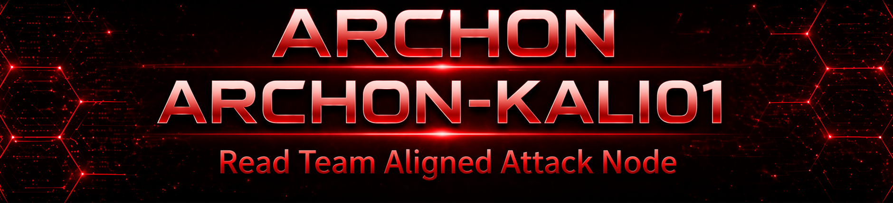

  

  
  
  
  

---

## **Overview**

**ARCHON-KALI01** is a dedicated Kali Linux attack node deployed within the ARCHON segmented lab environment. It is engineered to simulate internal adversarial behavior in a controlled and observable manner.

This system supports structured offensive workflows used to evaluate security posture, identify weaknesses, and validate defensive controls. All activity generated is intentional, measurable, and aligned with improving detection and response capabilities.

---

## **Operational Role**

<table>
<tr>
<td width="50%">

**Internal Adversary Simulation**  
Models real-world attacker behavior from inside the network boundary  

</td>
<td width="50%">

**Detection Validation Engine**  
Generates telemetry to validate SIEM and alerting pipelines  

</td>
</tr>

<tr>
<td width="50%">

**Enumeration & Recon Platform**  
Discovers hosts, services, and attack surface  

</td>
<td width="50%">

**Active Directory Analysis Node**  
Maps privilege paths and identity relationships  

</td>
</tr>
</table>

---

## **Core Capabilities**

**Reconnaissance & Mapping** - Identifying hosts, services, and network structure  

**Service Enumeration** - Discovering exposed protocols and misconfigurations  

**Credential Attack Simulation** - Testing authentication weaknesses in controlled scenarios  

**Active Directory Analysis** - Mapping relationships and potential privilege escalation paths  

**Detection Validation** - Producing activity to validate logging, alerting, and monitoring  

---

## **Core Tooling**

---

## **Network Placement & Architecture Role**

ARCHON-KALI01 operates within a segmented VLAN architecture designed to reflect enterprise network design principles.

It functions as an **internal adversary simulation node**, interacting with domain-joined systems and infrastructure components to test lateral movement, authentication flows, and inter-system communication under controlled conditions.

---

## **Security Design Philosophy**

<table>
<tr>
<td width="50%">

**Zero Trust Mindset**  
No implicit trust across any system boundary  

</td>
<td width="50%">

**High-Risk Classification**  
Treated as an untrusted, monitored endpoint  

</td>
</tr>

<tr>
<td width="50%">

**Visibility First**  
All activity is expected to be logged and analyzed  

</td>
<td width="50%">

**Controlled Adversary Simulation**  
Offensive actions are used to strengthen defenses  

</td>
</tr>
</table>

---

## **Framework Alignment**

**MITRE ATT&CK** - Mapping adversary techniques to detection capabilities  
**Cyber Kill Chain** - Structuring attack phases and simulation flow  
**OWASP Testing** - Web and application security validation  
**OSSTMM** - Structured and repeatable testing methodology  
**NIST Frameworks** - Alignment with enterprise control and assessment models  

---

## **Key Concepts Demonstrated**

**Internal Threat Simulation** - Emulating attacker behavior within trusted boundaries  

**Lateral Movement Awareness** - Understanding how access expands across systems  

**Enumeration-Driven Methodology** - Using discovered data to guide actions  

**Detection-Focused Testing** - Measuring how well defenses identify activity  

---

## **Lessons Learned**

**DNS Drives Active Directory Attacks** - Name resolution is foundational to many techniques  

**Segmentation Limits Movement** - Proper network design directly reduces attacker reach  

**Tool Accuracy Depends on Environment** - Configuration impacts reliability of results  

**Detection Relies on Visibility** - Logging gaps create blind spots  

**Framework Mapping Improves Strategy** - Contextualizing activity strengthens analysis  

---

## **Future Enhancements**

**SIEM Integration (Splunk)** - Enhanced correlation and alert validation  

**Advanced AD Attack Path Mapping** - Deeper privilege escalation analysis  

**Automated Attack Workflows** - Repeatable offensive testing scenarios  

**Detection Engineering Pipeline** - Continuous improvement of alerting logic  

**MITRE ATT&CK Coverage Dashboard** - Visual mapping of techniques vs detection  

---

  <strong>ARCHON</strong> 
  <em>Advanced • Reconnaissance • Control • Host • Operations • Network</em>

