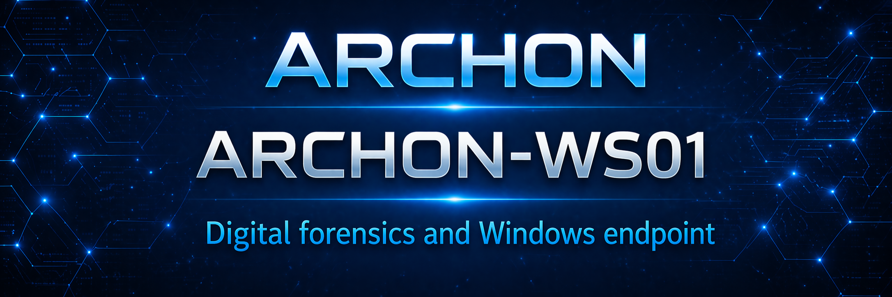
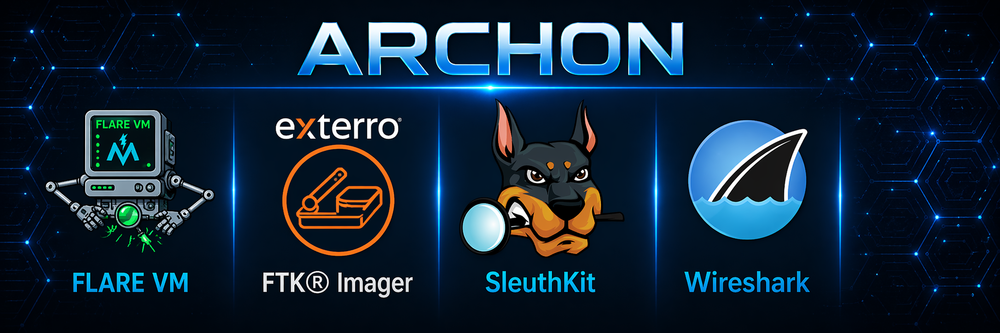

  

<h1 align="center">ARCHON-WS01</h1>

<strong>Digital Forensics & Analysis Workstation</strong>

  <em>Endpoint-level visibility, investigation, and controlled analysis within ARCHON</em>

---

## 🔍 Overview

**ARCHON-WS01** is a purpose-built **digital forensics and security analysis workstation** designed to support real-world investigative workflows, artifact analysis, and controlled execution of suspicious files.

It operates as a **hands-on DFIR platform**, enabling practical interaction with endpoint data, attacker behavior, and investigative processes.

---

## ⚙️ Core Capabilities

<table align="center">
<tr>
<td><strong>Digital Forensics</strong> Artifact and file system analysis for compromise identification</td>
<td><strong>Malware Observation</strong> Controlled execution and behavioral inspection</td>
</tr>
<tr>
<td><strong>Artifact Triage</strong> Validation and inspection of suspicious files</td>
<td><strong>Log Correlation</strong> Endpoint telemetry aligned with detection workflows</td>
</tr>
</table>

---

## 🧰 Tooling Environment

  

### **Forensic & Analysis Toolset**

**Disk & Artifact Analysis**  
Autopsy - File system analysis, artifact recovery, timeline generation  
FTK Imager - Disk imaging and evidence preview  

**Memory Analysis**  
Volatility - Memory forensics, process and artifact inspection  

**System & Persistence Analysis**  
Sysinternals Suite - Process analysis, autoruns, persistence visibility  

**Log & Event Analysis**  
Splunk - Log aggregation, correlation, and detection validation  
Windows Event Viewer - Native event log analysis  

**Network Analysis**  
Wireshark - Packet capture and protocol-level inspection  

**Malware Analysis & Reverse Engineering**  
Flare VM - Controlled analysis environment and tooling suite  
KAPE - Artifact collection and rapid triage  
PEStudio / Detect It Easy - Static file analysis  

---

## 🎯 Operational Focus

This workstation is centered around **analyst-driven execution**, emphasizing:

- Endpoint visibility and behavioral insight  
- Evidence handling and investigative workflow discipline  
- Detection validation against real activity  
- Understanding attacker techniques at the endpoint level  

---

## 🧪 Use Cases

- Suspicious file and artifact analysis  
- Incident response workflow practice  
- SIEM alert validation and tuning  
- Endpoint compromise simulation  
- Investigative skill development  

---

## 🧠 Design Philosophy

<table align="center">
<tr>
<td><strong>Functional</strong> Supports real investigative workflows</td>
<td><strong>Controlled</strong> Safe interaction with untrusted data</td>
<td><strong>Flexible</strong> Adapts to multiple analysis scenarios</td>
</tr>
</table>

---

## 📚 Key Takeaways

- Visibility drives effective investigation  
- Context is critical for accurate conclusions  
- Controlled execution reduces unnecessary risk  
- Methodology outweighs tooling volume  

---

## 📖 Framework Alignment

NIST Cybersecurity Framework  
NIST SP 800-61 - Incident Handling  
NIST SP 800-53 - Monitoring and Audit Controls  

---

## 🔐 Summary

**ARCHON-WS01** serves as a dedicated **forensic and analysis platform**, enabling hands-on investigation, controlled testing, and development of real-world security workflows.

It represents the **analytical layer of endpoint visibility** within ARCHON.
