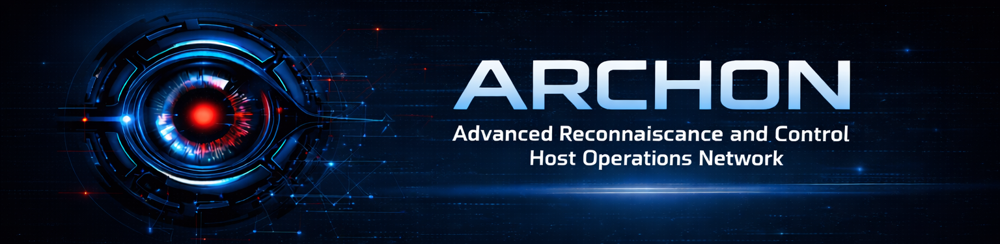
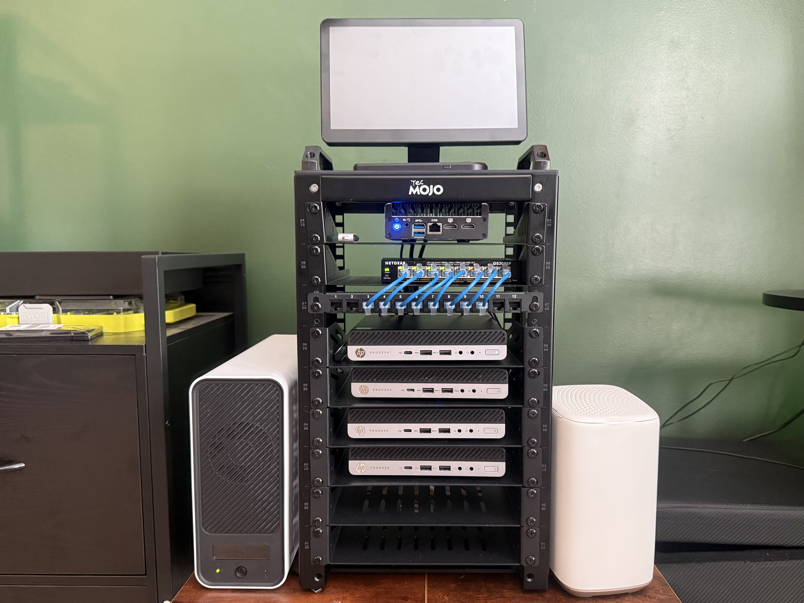

  

<h1 align="center">A.R.C.H.O.N Homelab</h1>

  Advanced Reconnaissance & Control Host Operations Network

  <i>Structured cybersecurity lab built for disciplined learning, operational awareness, and real-world skill development.</i>

  
  
  
  

━━━━━━━━━━━━━━━━━━━━━━━━━━━━━━━━━━━━━━━━

  <i>I want to give a quick thank you to my friend Reece Niemuth for being a mentor throughout this process and for the design inspiration behind this lab. Your guidance and perspective have played a major role in shaping what I’m building here, and I truly appreciate it.</i>

  

━━━━━━━━━━━━━━━━━━━━━━━━━━━━━━━━━━━━━━━━

<h2>🔎 Quick Snapshot</h2>

<strong>Purpose:</strong> Hands-on SOC and security engineering training environment 
<strong>Focus:</strong> Threat detection, log analysis, vulnerability assessment, and system integration 
<strong>Stack:</strong> Windows, Linux, SIEM, Active Directory, Firewall, Raspberry Pi 
<strong>Approach:</strong> Structured, disciplined, and process-oriented

━━━━━━━━━━━━━━━━━━━━━━━━━━━━━━━━━━━━━━━━

<h2>🖥️ Physical Lab Environment</h2>

  

  <i>Physical deployment of the ARCHON homelab environment supporting segmented networking, monitoring, and system integration.</i>

<h2>🎯 Purpose & Development Approach</h2>

This homelab is a continuously evolving environment built to develop practical cybersecurity and IT operations capability through hands-on implementation. The objective is not simply to assemble systems, but to understand how infrastructure behaves, how security controls are enforced, and how activity is detected, analyzed, and escalated in an operational setting.

The environment is intentionally structured around core security operations concepts, including <strong>network segmentation</strong>, <strong>centralized logging</strong>, <strong>continuous monitoring</strong>, <strong>endpoint visibility</strong>, and <strong>identity management</strong>. Each component is deployed with purpose and integrated to support realistic workflows such as alert triage, investigation, and response validation.

This lab is developed with reference to established security frameworks such as the NIST Cybersecurity Framework (CSF) and supporting guidance from NIST Special Publications, emphasizing structured control implementation, monitoring, and assessment practices.

My approach is influenced by prior military experience, emphasizing disciplined troubleshooting, escalation awareness, and structured analysis. This translates into building systems with clear boundaries, maintaining visibility across the environment, and approaching problems with a repeatable and methodical process.

This lab serves as a training ground to bridge theory and execution while reinforcing the mindset and technical foundations required for real-world cybersecurity roles.

━━━━━━━━━━━━━━━━━━━━━━━━━━━━━━━━━━━━━━━━

<h2>📚 Training Objectives</h2>

The environment is designed to build capability through direct interaction with systems, logs, and security controls across multiple domains.

<strong>Digital Forensics</strong> 
Analysis of system artifacts, event timelines, and evidence collection across Windows and Linux systems

<strong>Threat Hunting & Log Analysis</strong> 
Identification of anomalies and indicators of compromise through SIEM workflows

<strong>Security & Network Engineering</strong> 
Design and enforcement of segmented architecture and controlled traffic flow

<strong>Endpoint Detection & Response (EDR)</strong> 
Monitoring endpoint behavior and understanding detection and response mechanisms

<strong>Aggregation & Integration</strong> 
Centralizing and correlating logs across multiple systems

<strong>API Interaction & Automation</strong> 
Integrating tools and automating workflows through API-based communication

<strong>Active Directory</strong> 
Managing authentication, authorization, and policy enforcement in a domain environment

<strong>Cross-Platform Administration</strong> 
Operating across Windows and Linux environments to understand differences in system behavior and security controls

<strong>Vulnerability Assessment</strong> 
Identification, validation, and prioritization of system weaknesses through scanning and analysis

<strong>System Hardening & Baselines</strong> 
Applying and validating secure configuration standards aligned with industry benchmarks

━━━━━━━━━━━━━━━━━━━━━━━━━━━━━━━━━━━━━━━━

<h2>🧱 Core Infrastructure</h2>

<table>
<tr>
<td><strong>ISP Gateway</strong></td>
<td>External connectivity entry point into the lab environment</td>
</tr>

<tr>
<td><strong>Firewall</strong></td>
<td>Segmentation enforcement, access control, and traffic inspection between network zones</td>
</tr>

<tr>
<td><strong>SIEM</strong></td>
<td>Centralized logging, event correlation, and continuous monitoring</td>
</tr>

<tr>
<td><strong>Virtual Machines</strong></td>
<td>Windows and Linux systems used for endpoint simulation, attack emulation, and log generation</td>
</tr>

<tr>
<td><strong>Domain Controller</strong></td>
<td>Centralized identity management, authentication, and policy enforcement</td>
</tr>

<tr>
<td><strong>Raspberry Pi Monitoring Node</strong></td>
<td>Lightweight system providing health monitoring and supplemental visibility</td>
</tr>

<tr>
<td><strong>NAS</strong></td>
<td>Centralized storage for logs, configurations, and retained data</td>
</tr>

<tr>
<td><strong>UPS</strong></td>
<td>Power continuity and protection for system stability</td>
</tr>
</table>

━━━━━━━━━━━━━━━━━━━━━━━━━━━━━━━━━━━━━━━━

<h2>⚙️ Operational Focus</h2>

This environment is designed to simulate real-world security operations rather than isolated technical exercises.

Primary focus areas include generating and analyzing logs, identifying abnormal behavior, validating detections, performing vulnerability assessments, and understanding how systems interact during both normal operation and potential security events.

Emphasis is placed on <strong>visibility</strong>, <strong>control</strong>, and <strong>repeatability</strong>, ensuring that actions taken within the lab can be understood, documented, and refined over time.

<blockquote>
<strong>Note:</strong> This lab is actively developed and continuously refined as part of ongoing cybersecurity training and skill progression.
</blockquote>

━━━━━━━━━━━━━━━━━━━━━━━━━━━━━━━━━━━━━━━━

<h2>🌐 Topology</h2>

Baseline network design, segmentation layout, and system relationships are documented in the <code>topology-baseline</code> directory.

━━━━━━━━━━━━━━━━━━━━━━━━━━━━━━━━━━━━━━━━

<h2>📈 Status</h2>

Active development. Additional monitoring, integrations, automation, and detection capabilities are continuously being implemented.

