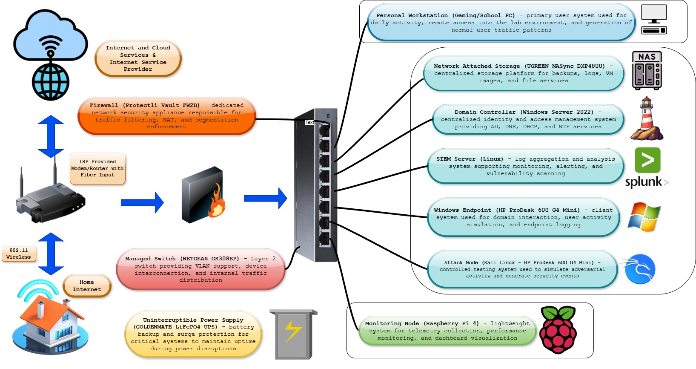

  

  <em>Segmented homelab architecture with firewall enforcement, SIEM visibility, and monitored infrastructure nodes</em>

<h2 align="center">Architecture Overview</h2>

  This environment is a segmented homelab designed to simulate real-world enterprise network operations,
  security monitoring, and controlled traffic flow across multiple network zones.

 

<h3>Network Segmentation</h3>

<b>WAN</b> - External untrusted network representing internet traffic 
<b>LAN</b> - Internal network hosting user systems and core services 
<b>MGMT</b> - Restricted network for administrative access and system control 
<b>LAB</b> - Isolated environment for testing, attack simulation, and validation

 

<h3>Core Components</h3>

<b>Firewall</b> - Enforces segmentation, filters traffic, and controls inter-network communication 
<b>SIEM</b> - Centralizes logs for monitoring, detection, and analysis 
<b>Domain Controller</b> - Handles authentication, authorization, and policy management 
<b>Raspberry Pi Monitor</b> - Tracks system health and supports lightweight monitoring 
<b>NAS</b> - Stores logs, backups, and lab data 
<b>Managed Switch</b> - Supports internal segmentation and network distribution 
<b>Virtual Machines</b> - Simulate endpoints, servers, and attacker systems

 

<h3>Traffic Flow</h3>

All inbound traffic is inspected at the firewall before entering internal networks.
Communication between segments is restricted and monitored to reduce unauthorized access
and limit lateral movement. Administrative access is isolated to the MGMT network.

 

<h3>Security Approach</h3>

<b>Defense in Depth</b> - Layered controls across network and systems 
<b>Least Privilege</b> - Restricted access to minimize exposure 
<b>Segmentation</b> - Isolates systems to reduce risk and contain threats 
<b>Centralized Monitoring</b> - Enables visibility across all components

 

<h3>Use Cases</h3>

Log analysis and correlation 
Brute force and anomaly detection 
Lateral movement simulation 
Firewall rule validation 
Incident response practice

